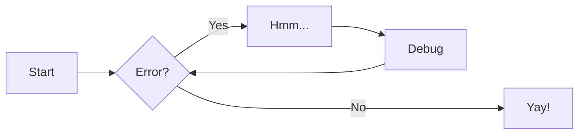

# Diagramme

## Mermaid

``` mermaid
graph LR
  A[Start] --> B{Error?};
  B -->|Yes| C[Hmm...];
  C --> D[Debug];
  D --> B;
  B ---->|No| E[Yay!];
```

## Plantuml

```puml
component Alice
url of Alice is [[http://www.google.com]]
[Alice]--> [Bob]
```