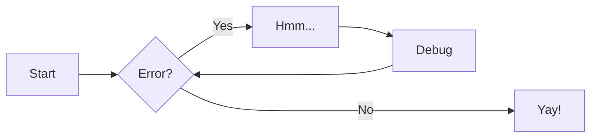
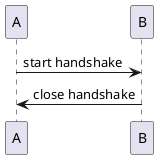

# Diagramme

## Mermaid

``` mermaid
graph LR
  A[Start] --> B{Error?};
  B -->|Yes| C[Hmm...];
  C --> D[Debug];
  D --> B;
  B ---->|No| E[Yay!];
```

## Plantuml

```puml
@startuml
A -> B: start handshake
B -> A: close handshake
@enduml
```